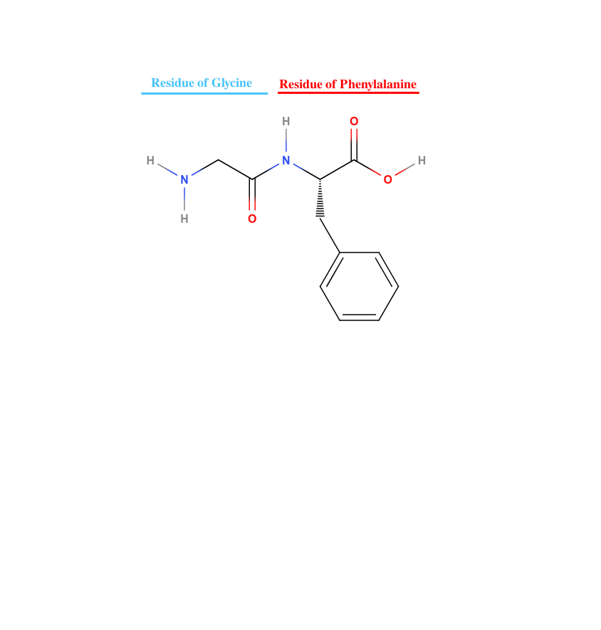

# Disambiguation Glossary of Genomics Terms

This glossary is for defining terms whose definition can not easily be found via a search engine. In technical fields it is not uncommon for words to have different meanings depending on context, or for words to have developed meanings from a specific practice or tradition, or just simple haphazard usage that unintentionally evolves within a discipline. This glossary serves as a means of clearing up these potential roadblocks on the way to a better understanding of genomics.

It **should be noted** however that these definitions are those of the authors of this guide. As with any set of complex terms, there is likely to be a wide range of disagreement on certain definitions, even if most practitioners would largely agree on most of the definitions of said set of terms. 

[a](#a) [b](#b) [c](#c) [d](#d) [e](#e) [f](#f) [g](#g) [h](#h) [i](#i) [j](#j) [k](#k) [l](#l) [m](#m) [n](#n) [o](#o) [p](#p) [q](#q) [r](#r) [s](#s) [t](#t) [u](#u) [v](#v) [w](#w) [x](#x) [y](#y) [z](#z)

## A
- ### Amplicon
	- _(in context of genomics and bioinformatics)_
	- A fragment of DNA/RNA that has been copied. This copying can happen naturally, but in context this is virtually always the result of thermocycling/polymerase chain reactions.  
[↑ back to top ↑](#Disambiguation-Glossary-of-Genomics-Terms)
## B
[↑ back to top ↑](#Disambiguation-Glossary-of-Genomics-Terms)
## C
[↑ back to top ↑](#Disambiguation-Glossary-of-Genomics-Terms)
## D
[↑ back to top ↑](#Disambiguation-Glossary-of-Genomics-Terms)
## E
[↑ back to top ↑](#Disambiguation-Glossary-of-Genomics-Terms)
## F
[↑ back to top ↑](#Disambiguation-Glossary-of-Genomics-Terms)
## G
[↑ back to top ↑](#Disambiguation-Glossary-of-Genomics-Terms)
## H
[↑ back to top ↑](#Disambiguation-Glossary-of-Genomics-Terms)
## I
[↑ back to top ↑](#Disambiguation-Glossary-of-Genomics-Terms)
## J
[↑ back to top ↑](#Disambiguation-Glossary-of-Genomics-Terms)
## K
[↑ back to top ↑](#Disambiguation-Glossary-of-Genomics-Terms)
## L
[↑ back to top ↑](#Disambiguation-Glossary-of-Genomics-Terms)
## M
[↑ back to top ↑](#Disambiguation-Glossary-of-Genomics-Terms)
## N
[↑ back to top ↑](#Disambiguation-Glossary-of-Genomics-Terms)
## O
[↑ back to top ↑](#Disambiguation-Glossary-of-Genomics-Terms)
## P
[↑ back to top ↑](#Disambiguation-Glossary-of-Genomics-Terms)
## Q
[↑ back to top ↑](#Disambiguation-Glossary-of-Genomics-Terms) 
## R
[↑ back to top ↑](#Disambiguation-Glossary-of-Genomics-Terms)
- ### R Group
	- _(in context of organic chemistry)_
	- Represents any combination of atoms and bonds that contains at least 1 carbon or hydrogen atom.

[↑ back to top ↑](#Disambiguation-Glossary-of-Genomics-Terms)   
- ### Residue
	- _(in context of amino acid/polypeptide)_ 
	- Possible misconception: "Is the [R group](#R-group) of an amino acid molecule."
	- Technically the residue of an amino acid in a peptide is all of the atoms of that amino acid that remain after the condensation reaction that adds it onto the peptide.
 

[↑ back to top ↑](#Disambiguation-Glossary-of-Genomics-Terms)
 
## S
[↑ back to top ↑](#Disambiguation-Glossary-of-Genomics-Terms)
## T
[↑ back to top ↑](#Disambiguation-Glossary-of-Genomics-Terms)
## U
[↑ back to top ↑](#Disambiguation-Glossary-of-Genomics-Terms)
## V
[↑ back to top ↑](#Disambiguation-Glossary-of-Genomics-Terms)
## W
[↑ back to top ↑](#Disambiguation-Glossary-of-Genomics-Terms)
## X
[↑ back to top ↑](#Disambiguation-Glossary-of-Genomics-Terms)
## Y
[↑ back to top ↑](#Disambiguation-Glossary-of-Genomics-Terms)
## Z
[↑ back to top ↑](#Disambiguation-Glossary-of-Genomics-Terms)
